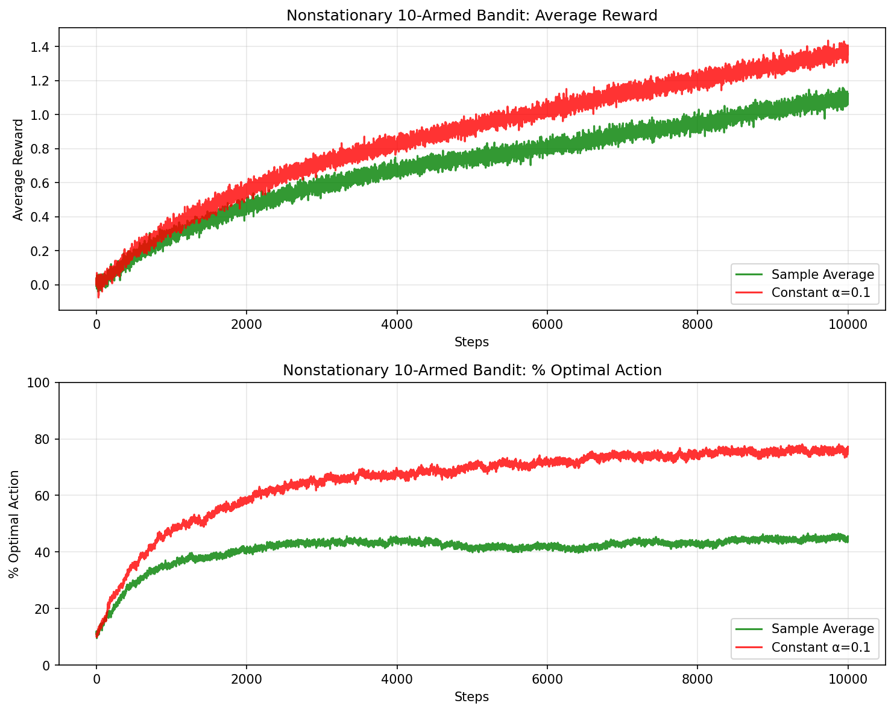
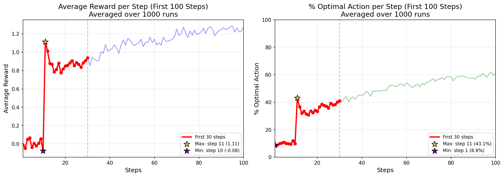
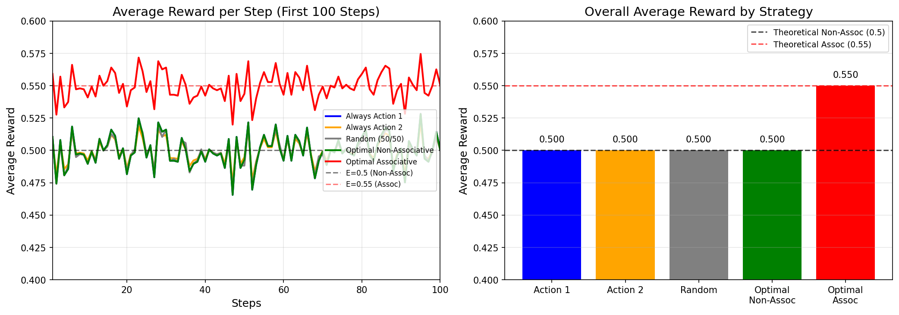
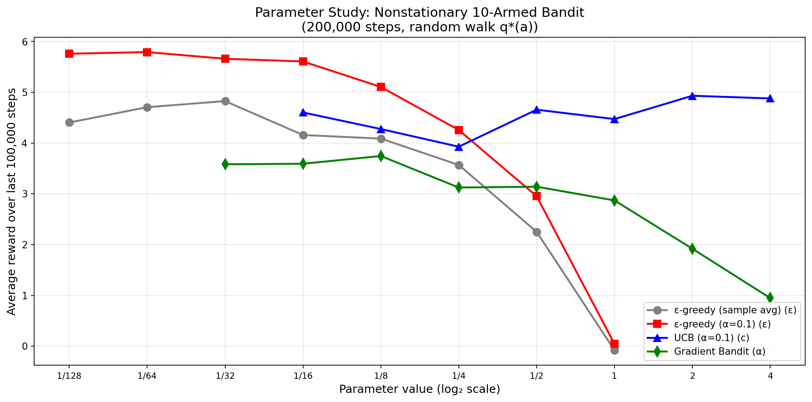

**Exercise 2.1 In ε-greedy action selection, for the case of two actions and ε = 0.5, what is the probability that the greedy action is selected?**

Sol:

$P(Greedy) = 0.5 * (1-0.5) + 0.5 = 0.75$


**Exercise 2.2: Bandit example Consider a k-armed bandit problem with k = 4 actions, denoted 1, 2, 3, and 4. Consider applying to this problem a bandit algorithm using ε-greedy action selection, sample-average action-value estimates, and initial estimates of Q1(a) = 0, for all a. Suppose the initial sequence of actions and rewards is $A_1 = 1, R_1 = 1, A_2 = 2, R_2 = 1, A_3 = 2, R_3 = 2, A_4 = 2, R_4 = 2, A_5 = 3, R_5 = 0.$ On some of these time steps the ε case may have occurred, causing an action to be selected at random. On which time steps did this definitely occur? On which time steps could this possibly have occurred?**

Sol:

```math
\begin{aligned}
&t = 1, Q_1 = R_1 = 1, Q_2 = Q_3 = Q_4 = 0. \text{Greedy action is } A_1 \\
&t = 2, Q_2 = R_2 = 1, Q_1 = 1, Q_3 = Q_4 = 0. \text{Greedy action is } A_1 \text{ and } A_2 \\
&t = 3, Q_2 = (R_2 + R_3) / 2 = 3 / 2 = 1.5, Q_1 = 1, Q_3 = Q_4 = 0. \text{Greedy action is } A_2 \\
&t = 4, Q_2 = (R_2 + R_3 + R_4) / 3 = 5 / 3 = 1.67, Q_1 = 1, Q_3 = Q_4 = 0. \text{Greedy action is } A_2 \\
&t = 5, Q_3 = R_5 = 0, Q_1 = 1, Q_2 = 1.67, Q_4 = 0. \text{Greedy action is } A_2 \\
\end{aligned}
```

From above, we get
  - Step 1: All action values are equal (all zero), so action 1 is greedy. ε-greedy may or may not have occurred.
  - Step 2: Actions 1 and 2 are tied as greedy (both have value 1). Selecting action 2 could be greedy or exploratory.
  - Step 3: Action 2 has the highest estimated value.
Selecting action 2 could be greedy or exploratory.
  - Step 4: Action 2 remains greedy.
Selecting action 2 could be greedy or exploratory.
  - Step 5: Action 3 is selected even though action 2 is greedy.
ε-greedy definitely occurred.

__Definitely occurred__: 5

__Possibly have occurred__: 1, 2, 3, 4


**Exercise 2.3 In the comparison shown in Figure 2.2, which method will perform best in the long run in terms of cumulative reward and probability of selecting the best action? How much better will it be? Express your answer quantitatively.**

Sol:

From Figure 2.2, ε-greedy with ε = 0.01 performs best in the long run.

Quantitatively:
  - ε = 0.01 selects the optimal action about 99% of the time
  - ε = 0.1 selects the optimal action about 91% of the time
  - ε = 0 performs poorly, converging to a suboptimal action in most runs due to insufficient exploration.

Thus, ε = 0.01 achieves the best balance between exploration and exploitation and yields the highest cumulative reward over time.


**Exercise 2.4 If the step-size parameters, αn, are not constant, then the estimate $Q_n$ is a weighted average of previously received rewards with a weighting different from that given by (2.6). What is the weighting on each prior reward for the general case, analogous to (2.6), in terms of the sequence of step-size parameters?**

Sol:

```math
\begin{aligned}
Q_{n+1} &= Q_n + a_n[R_n - Q_n] \\
        &= a_nR_n + (1-a_n)Q_n \\
        &= a_nR_n + (1-a_n)(a_{n-1}R_{n-1} + (1-a_{n-1})Q_{n-1}) \\
        &= a_nR_n + (1-a_n)a_{n-1}R_{n-1} + (1-a_n)(1-a_{n-1})Q_{n-1} \\
        &= a_nR_n + (1-a_n)a_{n-1}R_{n-1} + (1-a_n)(1-a_{n-1})a_{n-2}R_{n-2} + (1-a_n)(1-a_{n-1})(1-a_{n-2})Q_{n-2} \\
        &= \prod_{i=1}^{n} (1-a_i) Q_1 + \sum_{i=1}^n\prod_{j=i+1}^n (1-a_j)a_iR_i
\end{aligned}
```


**Exercise 2.5 (programming) Design and conduct an experiment to demonstrate the difficulties that sample-average methods have for nonstationary problems. Use a modified version of the 10-armed testbed in which all the q\*(a) start out equal and then take independent random walks (say by adding a normally distributed increment with mean zero and standard deviation 0.01 to all the q\*(a) on each step). Prepare plots like Figure 2.2 for an action-value method using sample averages, incrementally computed, and another action-value method using a constant step-size parameter, α = 0.1. Use ε = 0.1 and longer runs, say of 10,000 steps.**

Sol:


Program: [exercise_2_5_nonstationary.py](exercise_2_5_nonstationary.py)

Performance (last 1000 steps average):

Method |                Avg Reward |   % Optimal Actions
---- | ---- | ---
Sample Average |             1.062 |       44.6%
Constant α=0.1 |             1.327 |       75.8%

Improvement with constant step-size:
- Reward: +24.9%
- Optimal action: +31.2 percentage points

Sample averages weight all past rewards equally, making them
slow to adapt when action values change. Constant step-size
gives more weight to recent rewards, tracking changes better.


**Exercise 2.6: Mysterious Spikes The results shown in Figure 2.3 should be quite reliable because they are averages over 2000 individual, randomly chosen 10-armed bandit tasks. Why, then, are there oscillations and spikes in the early part of the curve for the optimistic method? In other words, what might make this method perform particularly better or worse, on average, on particular early steps?**

Sol:

The oscillations and spikes arise because all action values are initialized optimistically and equally.

Early on:
  - All actions appear equally promising
  - Small differences in early rewards cause large shifts in which action is greedy
  - This leads to frequent switching among actions

As learning proceeds:
  - Estimates become more accurate
  - Switching decreases
  - Performance stabilizes

Because optimism deterministically forces exploration, early lucky rewards can temporarily concentrate selection on a good action, producing spikes even after averaging many runs.

Thus, the spikes are caused by competition among optimistic action-value estimates combined with greedy selection in the early steps.


**Exercise 2.7: Unbiased Constant-Step-Size Trick In most of this chapter we have used sample averages to estimate action values because sample averages do not produce the initial bias that constant step sizes do (see the analysis in (2.6)). However, sample averages are not a completely satisfactory solution because they may perform poorly on nonstationary problems. Is it possible to avoid the bias of constant step sizes while retaining their advantages on nonstationary problems? One way is to use a step size of to process the nth reward for a particular action, where α > 0 is a conventional constant step size, and on is a trace of one that starts at 0: Carry out an analysis like that in (2.6) to show that $Q_n$ is an exponential recency-weighted average without initial bias.**

Sol: 

```math
\begin{aligned}

\text{We know,} \\

Q_{n+1} &= Q_n + \beta_n[R_n - Q_n] \\
        &= \beta_nR_n + (1-\beta_n)Q_n \\
        &= \prod_{i=1}^{n} (1-\beta_i) Q_1 + \sum_{i=1}^n\prod_{j=i+1}^n (1-\beta_j)\beta_iR_i \\

\text{Given } \bar{o}_0&=0 \text{ and } \bar{o}_n = \bar{o}_{n-1} + \alpha(1-\bar{o}_{n-1}) \\
\bar{o}_1=\alpha.  &\text{Therefore,} \\

\beta_1 &= \alpha / \bar{o}_1 \\ 
        &= \alpha /\alpha  \\
        &= 1  \\

\text{Hence, } \\

Q_{n+1} &= \prod_{i=1}^{n} (1-\beta_i) Q_1 + \sum_{i=1}^n\prod_{j=i+1}^n (1-\beta_j)\beta_iR_i \\
        &= (1-\beta_1) \prod_{i=2}^{n} (1-\beta_i) Q_1 + \sum_{i=1}^n\prod_{j=i+1}^n (1-\beta_j)\beta_iR_i \\
        &= \sum_{i=1}^n\beta_i\prod_{j=i+1}^n (1-\beta_j)R_i \\      
\end{aligned}
```

The weights:
  - Sum to 1
  - Decay exponentially with time

Thus, $Q_n$ is an exponential recency-weighted average without initial bias, combining the advantages of constant step sizes with unbiased estimation.

Here is the proof weights: $\beta_i\prod_{j=i+1}^n (1-\beta_j)$ sums to 1. 

Step 1: Solve the trace recurrence

The recurrence for $\bar{o}_n$ is: $\bar{o}_n = (1-\alpha)\bar{o}_{n-1} + \alpha$

This is a standard linear recurrence. Solving it: $\bar{o}_n = 1 - (1-\alpha)^n$

Step 2: Express $1 - \beta_n$

Using $\beta_n = \alpha / \bar{o}_n$:

$$1 - \beta_n
= 1 - \frac{\alpha}{1 - (1-\alpha)^n}
= \frac{1 - (1-\alpha)^n - \alpha}{1 - (1-\alpha)^n}$$

But note:

$$1 - (1-\alpha)^n - \alpha
= (1-\alpha)\left[1 - (1-\alpha)^{n-1}\right]$$

So:

$$1 - \beta_n
= (1-\alpha)\frac{1 - (1-\alpha)^{n-1}}{1 - (1-\alpha)^n}
= (1-\alpha)\frac{\bar{o}_{n-1}}{\bar{o}_n}$$


Step 3: Compute the product term

Now consider:

$\prod_{j=i+1}^n (1-\beta_j)$

Substitute the expression above:

$$\prod_{j=i+1}^n
\left(
(1-\alpha)\frac{\bar{o}_{j-1}}{\bar{o}_j}
\right)
= (1-\alpha)^{n-i}
\prod_{j=i+1}^n
\frac{\bar{o}_{j-1}}{\bar{o}_j}$$


This telescopes:

$$\prod_{j=i+1}^n
\frac{\bar{o}_{j-1}}{\bar{o}_j}
= \frac{\bar{o}_i}{\bar{o}_n}$$

Thus:

$$\prod_{j=i+1}^n (1-\beta_j)
= (1-\alpha)^{n-i} \frac{\bar{o}_i}{\bar{o}_n}$$


Step 4: Compute the weights explicitly

Recall:

$w_i = \beta_i \prod_{j=i+1}^n (1-\beta_j)$

Substitute:

$$w_i
= \frac{\alpha}{\bar{o}_i}
\cdot
(1-\alpha)^{n-i}
\cdot
\frac{\bar{o}_i}{\bar{o}_n}

= \frac{\alpha (1-\alpha)^{n-i}}{\bar{o}_n}$$

Step 5: Sum the weights

$$\sum_{i=1}^n w_i
= \frac{\alpha}{\bar{o}_n}
\sum_{i=1}^n (1-\alpha)^{n-i}$$

Reverse the index: let $k = n-i$:

$$= \frac{\alpha}{\bar{o}_n}
\sum_{k=0}^{n-1} (1-\alpha)^k$$

This is a geometric series:

$$\sum_{k=0}^{n-1} (1-\alpha)^k
= \frac{1 - (1-\alpha)^n}{\alpha}$$

Substitute:

$$\sum_{i=1}^n w_i
= \frac{\alpha}{\bar{o}_n}
\cdot
\frac{1 - (1-\alpha)^n}{\alpha}
= \frac{\bar{o}_n}{\bar{o}_n}
= 1$$

**Exercise 2.8: UCB Spikes In Figure 2.4 the UCB algorithm shows a distinct spike in performance on the 11th step. Why is this? Note that for your answer to be fully satisfactory it must explain both why the reward increases on the 11th step and why it decreases on the subsequent steps. Hint: if c = 1, then the spike is less prominent.**

Sol: 



Program: [exercise_2_8_ucb_analysis.py](exercise_2_8_ucb_analysis.py)

In UCB, each action must be tried at least once before its uncertainty estimate is defined.
  - Steps 1–10: Each of the 10 actions is selected once.
  - Step 11: All actions have equal uncertainty; selection is driven by the estimated action values, leading to a temporary increase in reward.
  - Subsequent steps: Actions with fewer selections have larger exploration bonuses, causing UCB to revisit suboptimal actions and lowering average reward.

The spike occurs because step 11 is the first step where exploitation dominates before confidence intervals diverge again. The spike occurs due to a brief exploitation phase followed by forced exploration driven by the confidence bounds.


**Exercise 2.9 Show that in the case of two actions, the soft-max distribution is the same as that given by the logistic, or sigmoid, function often used in statistics and artificial neural networks.**

Sol:

```math
\begin{aligned}
\pi(a_1) &= \frac{e^{H_1}}{e^{H_1} + e^{H_2}} \\
         &= \frac{1}{1 + e^{-(H_1-H_2)}} \\

\text{Sigmoid: } \sigma &= \frac{1}{1+e^{-x}}
\end{aligned}
```

Compare the two expressions, we get $\pi(a_1) = \sigma(H_1-H_2)$

Also, $\pi(a_2) = 1 - \pi(a_1) = \sigma(H_2-H_1)$

Thus, softmax is a multinomial generalization of the logistic function, and the logistic function is the two-action special case of softmax.


**Exercise 2.10 Suppose you face a 2-armed bandit task whose true action values change randomly from time step to time step. Specifically, suppose that, for any time step, the true values of actions 1 and 2 are respectively 0.1 and 0.2 with probability 0.5 (case A), and 0.9 and 0.8 with probability 0.5 (case B). If you are not able to tell which case you face at any step, what is the best expectation of success you can achieve and how should you behave to achieve it? Now suppose that on each step you are told whether you are facing case A or case B (although you still don’t know the true action values). This is an associative search task. What is the best expectation of success you can achieve in this task, and how should you behave to achieve it?**

Sol: 



  Key theoretical analysis:

  |          | Case A (p=0.5) | Case B (p=0.5) | Expected Value          |
  |----------|----------------|----------------|-------------------------|
  | Action 1 | 0.1            | 0.9            | 0.5×0.1 + 0.5×0.9 = 0.5 |
  | Action 2 | 0.2            | 0.8            | 0.5×0.2 + 0.5×0.8 = 0.5 |

  Part 1 (Non-associative): Both actions have E=0.5, so any strategy gives expected reward = 0.5

  Part 2 (Associative):
  - Case A → pick action 2 (0.2 > 0.1)
  - Case B → pick action 1 (0.9 > 0.8)
  - Expected reward = 0.5×0.2 + 0.5×0.9 = 0.55

  Improvement: Context gives 10% better reward (0.55 vs 0.5)


**Exercise 2.11 (programming) Make a figure analogous to Figure 2.6 for the nonstationary case outlined in Exercise 2.5 . Include the constant-step-size ε-greedy algorithm with α = 0.1. Use runs of 200,000 steps and, as a performance measure for each algorithm and parameter setting, use the average reward over the last 100,000 steps.**

Sol: 



Program: [exercise_2_11_parameter_study.py](exercise_2_11_parameter_study.py)

Average reward shown from the above graph:
  1. ε-greedy (α=0.1): 5.7924
  2. UCB (α=0.1): 4.9323
  3. ε-greedy (sample avg): 4.8271
  4. Gradient Bandit: 3.7458


In the nonstationary setting, methods with constant step sizes outperform sample-average methods because they weight recent rewards more heavily and adapt faster to changing action values.

While ε-greedy with constant step size performs best under the chosen parameters, performance is sensitive to hyperparameter tuning. Comparisons with UCB and gradient bandit methods depend strongly on their respective parameter settings.

Gradient bandit methods are sensitive to step-size and baseline choice, and often underperform value-based methods in nonstationary settings without careful tuning.
