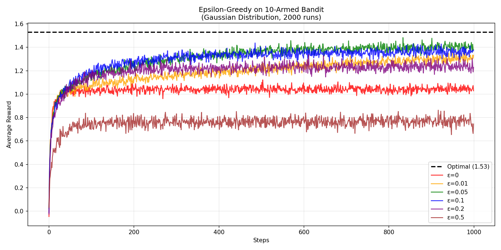
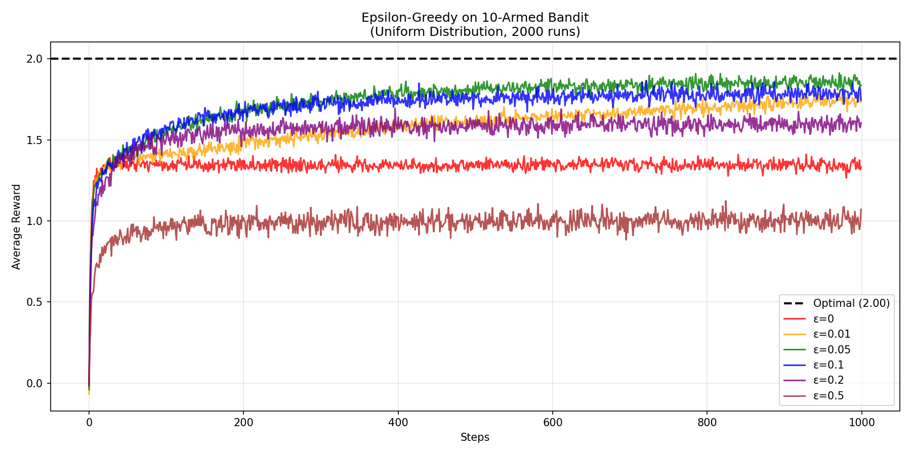
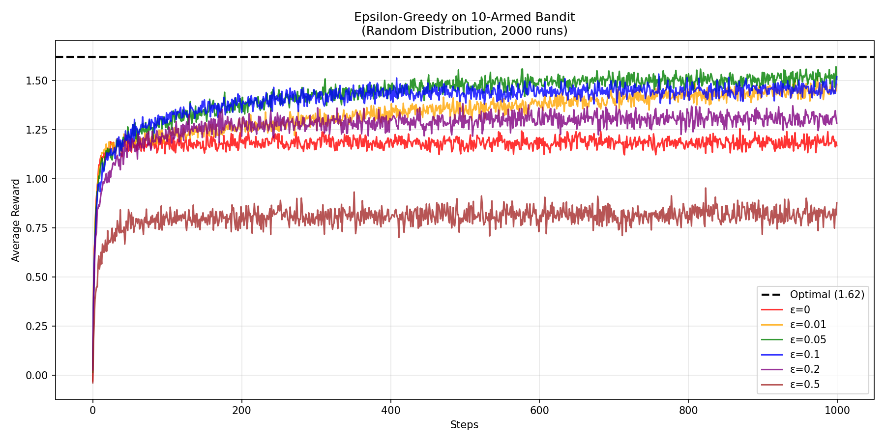

# Chapter 2: Multi-armed Bandits

## Epsilon-Greedy Bandit Simulation

This simulation demonstrates the epsilon-greedy action selection strategy on a 10-armed bandit problem.

### Running the Simulation

```bash
python3 epsilon_greedy_bandit.py
```

This generates the following results:

---

### Gaussian Distribution Results

Action values are sampled from a standard normal distribution N(0, 1), creating a realistic scenario where some arms are naturally better than others with varying degrees of separation.



---

### Uniform Distribution Results

Action values are evenly spaced in the range [-2, 2], providing a controlled experiment where the gap between optimal and suboptimal actions is consistent and predictable.



---

### Random Uniform Distribution Results

Action values are randomly sampled from Uniform(-2, 2), similar to Gaussian but with bounded values and no clustering around zero.



---

### Parameters

- **Epsilon values**: 0, 0.01, 0.05, 0.1, 0.2, 0.5
- **Number of arms**: 10
- **Steps per run**: 1000
- **Number of runs**: 2000 (averaged)

### Action Value Distributions

| Distribution | Description |
|--------------|-------------|
| Gaussian | q*(a) ~ N(0, 1) |
| Uniform | q*(a) evenly spaced in [-2, 2] |
| Random | q*(a) ~ Uniform(-2, 2) |

### Key Observations

- **ε=0** (greedy): Converges fastest initially but gets stuck on suboptimal actions
- **ε=0.1**: Good balance between exploration and exploitation
- **ε=0.5**: Too much exploration, never fully exploits learned values
